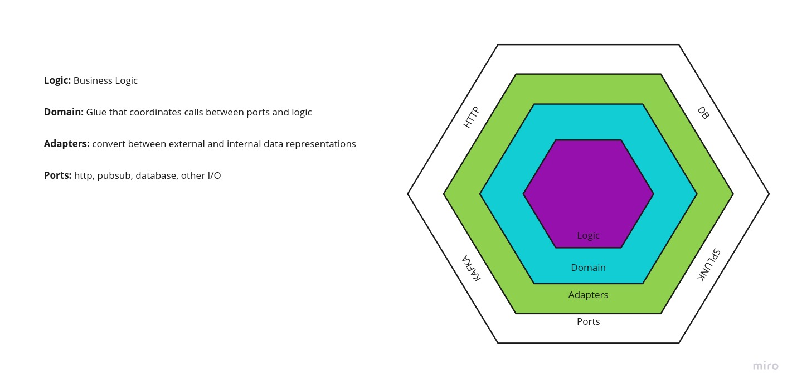

# Python API example (Hexagonal Arch.)

## Overview

Example of an APP built using python3, following Hexagonal Architecture. All the calls made by it are using the Python requests_mock.  

## Instalation

To use this APP example you will setup your enviroment first. 

### Setup

I stronglly recommend to use the [pyenv](https://github.com/pyenv/pyenv) project in order to segregate all libs instaled when testing it. 

### Requiriments

Once you already have setup the enviroment, run the commend below to install all necessary library:

```bash
$ pip install -r requirements.txt
```

## Architecture

As was on said on a previous topic, this APP is following an Hexagonal Architecture model. See the image below:




### Code Structure

```
.
├── src
|   └── prospect_analysis
│       ├── adapters
|       |   ├── http.py
|       |   └── __init__.py
│       ├── diplomat
|       |   ├── fixtures.py
│       │   ├── http_in.py
│       │   ├── http_out.py
|       |   └── __init__.py
│       ├── domain
│       │   ├── schema.py
|       |   ├── source.py
|           └── __init__.py
│       ├── logic
|       |    └── national_records.py  
|       └── __init__.py
├── test
│   ├── unit
|   ├── __init__.py
│   ├── fixtures.py
│   ├── adapters
|   |   ├── __init__.py
|   |   └── http_test.py
│   └── logic
|       ├── __init__.py
|       └── national_records.py
├── __init__.py   
├── README.md
└── requirements.txt

```

## Running the Applcation

To run the application make sure that you are on the packages path, that is `src/prospect_analysis`.

Now you need to execute the main file passing an json as argument. e.g.:

```bash
$ python3 main.py '{"national_id_number": 1006, "first_name": "cesar", "last_name": "santana"}'
```

## Testing

To ensure the application works correctly, we wrote some tests and tried to anticipate any problems that might appear.

### Running tests

To run the application tests make sure that you are on the packages path, that is `src/prospect_analysis`.

Once you are there run the command bellow:

```bash
$ python3 -m pytest ../../test/
```
